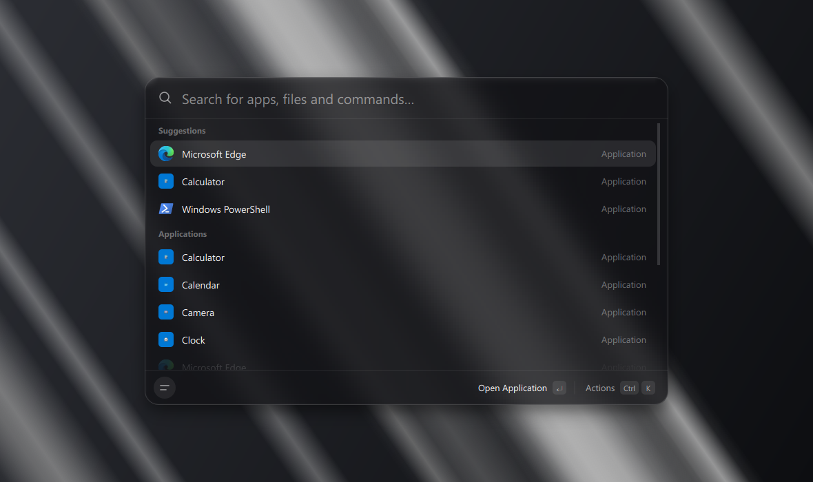

<div align="center">


# Spotty

[English](README.md) · **Русский**

Строка быстрого запуска для Windows — как Spotlight на Mac.
Нажмите `Ctrl + E`, начните печатать название — Enter.



</div>

## Скачать

1. Откройте страницу [Releases](https://github.com/SmeshidoJoe/Spotty/releases/latest).
2. Скачайте файл `Spotty-Setup-….exe` и запустите его.
3. Права администратора не нужны. После установки строка откроется сама.

Если Windows покажет синее окно «Система Windows защитила ваш компьютер» —
нажмите **Подробнее → Выполнить в любом случае**. Так бывает со всеми
программами без платной цифровой подписи.

Работает на Windows 10 и 11. Интерфейс по умолчанию на английском — русский
включается в настройках: `Ctrl + ,` → Language → Русский.

## Как пользоваться

Spotty живёт в трее, рядом с часами. Нажмите **`Ctrl + E`** в любой программе —
появится строка. Печатайте, выбирайте стрелками, запускайте Enter. Закрыть —
`Esc` или клик мимо.

Что можно найти:

- **Программы** — всё, что есть в меню «Пуск», включая Калькулятор,
  Параметры и другие приложения из Магазина. А ещё Spotty раз в день
  просматривает все диски и находит портативные программы и игры, которых
  в «Пуске» нет. Они появляются при поиске, рядом написана их папка.
  Только что установленная программа появляется через пару секунд после
  установки — с меткой **Новое**, и на пустой строке она стоит первой.
  Метка пропадает, когда программу откроют, или через сутки.
- **Файлы и папки** — с рабочего стола, из Документов и Загрузок.
  Список папок меняется в настройках. Новые, переименованные и удалённые
  файлы видны в поиске сразу.
- **Калькулятор** — наберите `12*(3+4)^2`, ответ появится сразу.
  Enter копирует его.
- **Команды** — начните с `>`, например `> ipconfig /all`. Команда откроется
  в новом окне командной строки.
- **Интернет** — в конце любой выдачи есть «Искать в Google …». Начните с `?`,
  чтобы сразу искать в интернете: `? погода на завтра`. Наберите адрес сайта,
  например `github.com`, — Spotty предложит его открыть.

Ещё пара удобств:

- Что запускаете часто, поднимается выше. Если на «t» вы всегда открываете
  Telegram, в следующий раз он будет первым.
- Забыли переключить раскладку? `еудупкфь` найдёт Telegram.
- Можно сокращать: `vsc` — Visual Studio Code, `ntpd` — Notepad.

## Клавиши

| Сочетание | Что делает |
|-----------|------------|
| `Ctrl + E` | открыть или закрыть строку (меняется в настройках) |
| `↑` `↓` | выбрать пункт |
| `Enter` | открыть |
| `Ctrl + Enter` | второе действие: запуск от администратора, для файла — показать в папке |
| `Ctrl + K` | все действия с пунктом: показать в папке, скопировать путь, скрыть из результатов, удалить программу и другие |
| `Ctrl + Shift + C` | скопировать путь, команду или ответ калькулятора |
| `Ctrl + ,` | настройки |
| `Esc` | очистить строку, второй раз — закрыть |

## Настройки

Кнопка в левом нижнем углу строки, `Ctrl + ,` или правый клик по значку в трее.
Там можно:

- поменять сочетание для вызова;
- не открывать строку поверх полноэкранных игр и плееров: пока такая
  программа впереди, сочетание достаётся ей. Браузеров это не касается —
  поверх видео на весь экран строка откроется как обычно;
- включить или выключить запуск вместе с Windows;
- выбрать язык: английский или русский;
- выбрать поисковик: Google, Яндекс, DuckDuckGo или Bing;
- выключить поиск программ на всех дисках;
- выключить стеклянный фон;
- добавить или убрать папки для поиска файлов;
- вернуть пункты, которые скрыли из результатов;
- проверить обновления и выбрать, что делать, когда вышла новая версия:
  - **Скачивать в фоне** (так по умолчанию) — обновление качается, пока вы
    работаете. Когда оно готово, в строке появится кнопка **Перезапустить и
    обновить** и будет ждать, пока вы её не нажмёте;
  - **Сообщать** — в углу экрана появится уведомление. Нажмите на него —
    обновление скачается прямо в строке, с полосой прогресса, и Spotty
    перезапустится.

  «Проверить обновления» в меню трея всегда качает в фоне.

## Вопросы

**`Ctrl + E` нужен мне в другой программе.** Пока Spotty запущен, это сочетание
работает только для него — например, в браузере `Ctrl + E` больше не ставит
курсор в поиск. Выберите другое в настройках, например `Alt + Space`. Если
сочетание мешает в игре, включите «Не открывать поверх полноэкранных программ».

**Строка открывается медленно или стекло выглядит странно.** Выключите
«Стеклянный фон» в настройках — строка станет просто тёмной.

**Нужного файла нет в поиске.** Добавьте его папку в настройках. Скрытые файлы,
`node_modules`, `.git` и подобные служебные папки не ищутся специально. Если
вы скрыли файл или его папку через `Ctrl + K`, верните в «Настройки → Скрытые
из результатов»: скрытая папка прячет всё, что в ней лежит.

**Программы с диска нет в поиске.** Программа, поставленная установщиком,
находится сразу. Поиск по дискам пропускает Windows и
ProgramData, Загрузки (там лежат установщики), git-репозитории и служебные
программы: установщики, обновлялки, консольные утилиты. Если программа есть в
«Пуске», она найдётся под своим названием оттуда. Сколько программ нашлось,
видно в «Настройки → Программы на всех дисках»; «Обновить список файлов и
программ» в строке просматривает диски заново.

**Как удалить программу через Spotty?** Выберите её, нажмите `Ctrl + K` →
«Удалить программу…» и ещё раз Enter — Spotty переспрашивает, потому что
некоторые деинсталляторы удаляют программу молча. Запускается собственный
деинсталлятор программы, приложение из Магазина удаляется так же, как из меню
«Пуск». Пункт есть, только если Spotty уверен, чей это деинсталлятор: у
портативных программ его нет.

**Где лежат настройки?** В `%APPDATA%\Spotty`. Кэш иконок и списка программ —
в `%LOCALAPPDATA%\Spotty`, его можно удалить, он соберётся заново. Скачанное
обновление ждёт в папке `_update` рядом со `Spotty.exe`.

**Как удалить?** «Параметры → Приложения → Spotty → Удалить». Установщик
спросит, оставить ли настройки.

## Для разработчиков

Нужен Python 3.13.

```bash
pip install -r requirements.txt
```

```bash
python main.py --show
```

Тесты:

```bash
pip install -r requirements-dev.txt
```

```bash
python -m pytest
```

Сборка exe и установщика:

```bash
pip install pyinstaller pillow
```

```bash
python tools/make_assets.py
```

```bash
pyinstaller --clean --noconfirm Spotty.spec
```

Затем откройте `spotty_setup.iss` в [Inno Setup 6](https://jrsoftware.org/isinfo.php)
и нажмите Compile — установщик появится в `installer_output`.

Версия задаётся в одном месте — `spotty/core/constants.py`. Для
самообновления к релизу на GitHub нужно приложить, кроме установщика, zip-архив
с `Spotty.exe` внутри: программа скачивает именно его.

Стекло — шейдер из проекта [CopyPasta](https://github.com/SmeshidoJoe/CopyPasta):
под строкой снимается экран, размывается на видеокарте и преломляется по краю.
